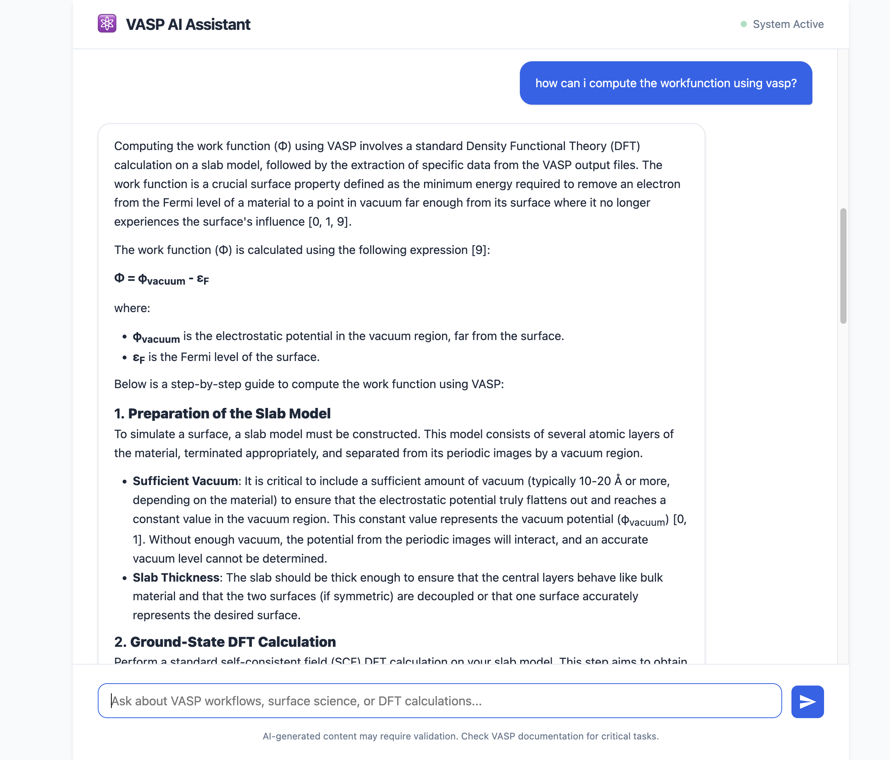

# 🧠 VASP AI Assistant


## Ask DeepWiki about this!

[](https://deepwiki.com/Iriansr/vasp-ai-assistant)

## Demo



An AI-powered assistant for computational materials science, designed to answer questions about VASP workflows using a hybrid **RAG + Web Search agent system** built with the **Google Agent Development Kit (ADK)**.

The system combines:
- 📚 **Retrieval-Augmented Generation (RAG)** over curated VASP documentation  
- 🌐 **Web search fallback** for broader queries  
- 🤖 **Modular ADK Agents** (Specialists & Coordinator)
- 💾 **Persistent Session Memory** using SQLite
- 💬 **Custom chat interface** with Markdown support
---

## 🚀 Features

- 🔀 **Intelligent Coordination**: Powered by a lead coordinator agent that routes between specialist expert agents.
- 📖 **Domain-specific knowledge**: Optimized for VASP, DFT, and surface science.
- 💬 **Conversational Memory**: Remembers past turns in a session, stored persistently in SQLite.
- 🧪 **Scientific Validation**: Every answer is vetted by a validator agent for rigor and grounding.
- 🔁 **Smart Fallback**: Automatically tries web research if local VASP documentation is insufficient.

---

## 📁 Project Structure
```
vasp-ai-assistant/
│
├── tools.py            # ADK Tools wrapping RAG and Web pipelines
├── agents.py           # Definition of vasp_expert, web_researcher, and validator
├── orchestration.py    # Coordinator agent and routing logic
├── api/                # FastAPI backend using ADK Runner
│   └── main.py         # Main entry point with persistent sessions
├── rag_vasp/           # Core RAG pipeline (retriever, reranker, ingestion)
├── web_search/         # Web search agent implementation
├── sessions.db         # Persistent SQLite session database (Auto-generated)
├── frontend/           # Chat UI (HTML/CSS/JS)
├── nodes/              # [LEGACY] Original LangGraph nodes
├── graph/              # [LEGACY] Original LangGraph orchestration
└── README.md
```
---

## ⚙️ Installation & Usage

### 1. Clone & Environment

```bash
git clone https://github.com/your-username/vasp-ai-assistant.git
cd vasp-ai-assistant
conda env create -f environment.yml
conda activate vasp-rag
```

### 2. Infrastructure (Elasticsearch)

Ensure Elasticsearch is running locally for the RAG system:

```bash
docker run -p 9200:9200 -e "discovery.type=single-node" elasticsearch:8.11.0
```

### 3. Data Ingestion (First run only)

Ingest the VASP documentation into the vector database:

```bash
python -m rag_vasp.ingestion_script
```

### 4. Run Backend

Start the FastAPI server:

```bash
uvicorn api.main:app --reload
```

The API will be available at `http://127.0.0.1:8000`. Conversational history is stored in `sessions.db`.

### 5. Run Frontend

Open `frontend/index.html` or serve it:
```bash
cd frontend
python -m http.server 5500
```
Then open `http://localhost:5500`

---

## 🧠 Tech Stack
- **LLM**: Vertex AI (Gemini 2.5 Flash)
- **Framework**: Google Agent Development Kit (ADK)
- **Backend**: FastAPI
- **Vector DB**: Elasticsearch
- **Memory**: SQLite (Persistent Sessions)
- **Frontend**: HTML / CSS / JS

---

## 🧪 Example Queries
- "How do I calculate band structures in VASP?"
- "What is the physical meaning of the Fermi level?"
- "How to compute surface energy? (followed by: How to do it in VASP?)"

---

## ⚠️ Notes
- Ensure **Vertex AI** credentials are properly configured (ADC).
- The agents use the full resource path for Vertex AI models for authentication stability.
- `sessions.db` can be deleted if you wish to wipe all conversation history.
